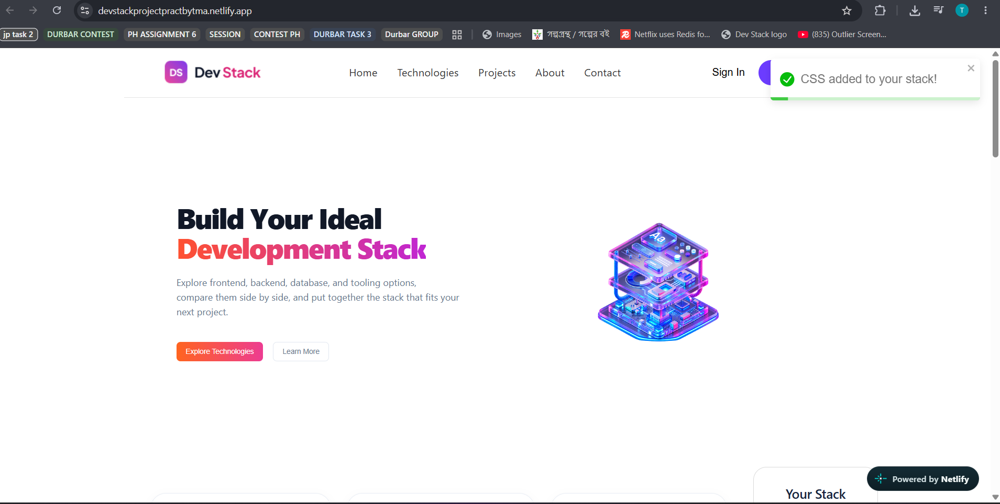

# Dev Stack

A modern and responsive developer technology stack explorer for discovering technologies and building a personalized development stack.

---

## Table of Contents

- [About the Project](#about-the-project)
- [Project Overview](#project-overview)
- [Key Features](#key-features)
- [Tech Stack](#tech-stack)
- [Dependencies](#dependencies)
- [Installation & Setup](#installation--setup)
- [Folder Structure](#folder-structure)
- [Contributions](#contributions)
- [How to Contribute](#how-to-contribute)
- [License](#license)
- [Contact](#contact)

---

## About the Project

**Dev Stack** is a modern and responsive web application that helps developers explore different technologies and create their own personalized development stack.

The application provides information about technologies across categories such as **frontend, backend, database, and development tools**, including their descriptions, difficulty levels, ratings, and other relevant information.

Users can explore available technologies and add their preferred technologies to a personal **"Your Stack"** collection.

---

## Project Overview

Dev Stack was developed as a frontend-focused React project to practice building a modern, interactive, and responsive web application.

The project focuses on:

- Exploring different development technologies
- Organizing technologies by category
- Displaying useful information about each technology
- Creating a personalized technology stack
- Providing an intuitive and responsive user experience

### Project Screenshot

<p align="center">
  
</p>

### Live Demo

🔗 **Live Site:**  
https://devstackprojectpractbytma.netlify.app/

---

## Key Features

### 🔍 Explore Technologies

Browse different development technologies organized into categories such as:

- Frontend
- Backend
- Database
- Development Tools

Each technology provides useful information including its:

- Name
- Description
- Category
- Difficulty level
- Rating
- Other relevant details

### 📦 Build Your Own Stack

Users can create their own personalized development stack by:

- Adding technologies to their stack
- Removing individual technologies
- Clearing the entire stack

### 📱 Responsive Design

The application is designed to work across different screen sizes:

- Desktop
- Tablet
- Mobile

It also includes a responsive mobile navigation menu for smaller devices.

### 🔔 User Feedback

Interactive actions provide visual feedback using toast notifications, making it easier for users to understand actions such as adding or removing technologies.

---

## Tech Stack

### Frontend

- **React.js**
- **JavaScript**
- **HTML5**
- **CSS3**

### Libraries & Tools

- **React Toastify** — Toast notifications
- **Vite** — Development server and build tool
- **JSON** — Technology data management

### Deployment

- **Netlify**

---

## Dependencies

The project uses the following major dependencies and development tools:

```text
React
React DOM
React Toastify
Vite


> Exact package versions are available in `package.json`.

---

## Installation & Setup

### 1. Clone the repository

```bash
git clone https://github.com/tayassukmdabir95/devpractweb.git
cd devpractweb
